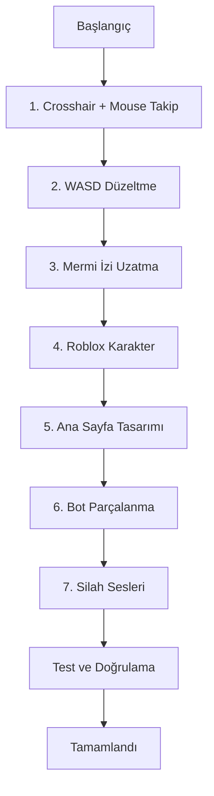

# Housefire Arena v2.0 Geliştirme Planı

Bu belge, Housefire Arena oyununun 2.0 sürümü için geliştirme görevlerini ve teknik detayları içermektedir.

---

## 📋 Özet

| # | Görev | Öncelik | Dosyalar |
|---|-------|---------|----------|
| 1 | Crosshair kaldır + Mouse takipli dönüş + Fener | Yüksek | `input.js`, `player.js`, `main.js`, `ui.js`, `style.css` |
| 2 | WASD tuşları düzeltme | Yüksek | `input.js` |
| 3 | Mermi izi uzatma | Orta | `effects.js`, `weapons.js` |
| 4 | Roblox tarzı karakter modeli | Orta | `player.js`, `bot.js` |
| 5 | Ana sayfa tasarımı | Orta | `index.html`, `style.css` |
| 6 | Bot parçalanma efekti | Düşük | `bot.js`, `effects.js` |
| 7 | Silah sesleri | Orta | `audio.js` |

---

## 1. 🎯 Crosshair Kaldırma ve Mouse Takipli Dönüş Sistemi

### Mevcut Durum
- Crosshair ekranın ortasında sabit duruyor
- Pointer Lock API kullanılıyor (fare kilitleniyor)
- Karakter dönüşü `mouseDelta.x` ile yapılıyor

### Hedef
- Crosshair tamamen kaldırılacak
- Fare pozisyonu takip edilecek (Pointer Lock olmadan)
- Karakter farenin olduğu yöne dönecek
- Fener de o yöne bakacak

### Teknik Değişiklikler

#### 1.1 [`input.js`](public/js/input.js) Değişiklikleri
```javascript
// Yeni metod eklenecek:
getWorldMousePosition(camera, playerPosition) {
    // Fare ekran pozisyonunu world koordinatlarına çevir
    // Raycasting kullanarak zemin düzleminde nokta bul
}
```

#### 1.2 [`player.js`](public/js/player.js) Değişiklikleri
```javascript
// rotate() metodu değişecek:
rotateTowards(targetWorldPosition) {
    // Hedef noktaya bakacak şekilde rotation hesapla
    const angle = Math.atan2(
        this.position.x - targetWorldPosition.x,
        this.position.z - targetWorldPosition.z
    );
    this.rotation = angle;
}
```

#### 1.3 [`main.js`](public/js/main.js) Değişiklikleri
- `handleMouseMove()` fonksiyonu güncellenecek
- Pointer Lock yerine sürekli fare takibi yapılacak

#### 1.4 [`ui.js`](public/js/ui.js) ve [`style.css`](public/css/style.css)
- Crosshair elementi gizlenecek/kaldırılacak

---

## 2. ⌨️ WASD Tuşları Düzeltme

### Mevcut Sorun
- `getMovementVector()` fonksiyonunda yön hesaplaması hatalı olabilir
- Tuş bazen tepki vermiyor

### Analiz
Mevcut kodda `input.js` satır 147-176:
```javascript
getMovementVector(rotation) {
    // W: ileri, S: geri, A: sol, D: sağ
    // Dönüş açısına göre hareket yönü hesaplanıyor
}
```

### Çözüm
- Hareket yönü kamera açısından bağımsız olmalı (izometrik görünüm için)
- Tuş durumları daha güvenilir takip edilmeli

#### 2.1 [`input.js`](public/js/input.js) Değişiklikleri
```javascript
// Yeni: Kameradan bağımsız hareket (izometrik için)
getMovementVector() {
    let dx = 0, dz = 0;
    
    // Ekran koordinatlarında hareket
    if (this.isKeyDown('w')) dz -= 1; // Kuzey
    if (this.isKeyDown('s')) dz += 1; // Güney
    if (this.isKeyDown('a')) dx -= 1; // Batı
    if (this.isKeyDown('d')) dx += 1; // Doğu
    
    // Normalize et
    const len = Math.sqrt(dx * dx + dz * dz);
    if (len > 0) {
        dx /= len;
        dz /= len;
    }
    
    return { x: dx, z: dz, moving: len > 0 };
}
```

---

## 3. 🔫 Mermi İzi Uzatma

### Mevcut Durum
[`effects.js`](public/js/effects.js) satır 187-212:
```javascript
createBulletTrail(start, end, color) {
    // Mermi izi ömrü: 10 frame
    this.trails.push({
        mesh: trail,
        life: 10,  // ← Bu değer artırılacak
        maxLife: 10
    });
}
```

### Çözüm
- `life` ve `maxLife` değerleri artırılacak (örn: 30-40 frame)
- Mermi izi kalınlığı ve opaklığı ayarlanabilir

#### 3.1 [`effects.js`](public/js/effects.js) Değişiklikleri
```javascript
createBulletTrail(start, end, color) {
    // ... mevcut kod ...
    
    this.trails.push({
        mesh: trail,
        life: 40,      // 10 → 40
        maxLife: 40    // 10 → 40
    });
}
```

---

## 4. 👤 Roblox Tarzı Karakter Modeli

### Mevcut Durum
- Basit silindir (cylinder) geometrisi kullanılıyor
- [`player.js`](public/js/player.js) satır 48-69 ve [`bot.js`](public/js/bot.js) satır 63-80

### Hedef
Roblox tarzı blok karakter:
- Kafa (küp)
- Gövde (dikdörtgen prizma)
- Kollar (2 adet, yanda)
- Bacaklar (2 adet, altta)

### Teknik Uygulama

#### 4.1 Yeni Karakter Model Fonksiyonu
```javascript
function createRobloxStyleCharacter(color) {
    const group = new THREE.Group();
    
    // Kafa (üstte)
    const head = new THREE.Mesh(
        new THREE.BoxGeometry(0.5, 0.5, 0.5),
        new THREE.MeshStandardMaterial({ color: 0xffcc99 }) // Ten rengi
    );
    head.position.y = 1.4;
    group.add(head);
    
    // Gövde
    const torso = new THREE.Mesh(
        new THREE.BoxGeometry(0.6, 0.8, 0.4),
        new THREE.MeshStandardMaterial({ color: color })
    );
    torso.position.y = 0.8;
    group.add(torso);
    
    // Sol kol
    const leftArm = new THREE.Mesh(
        new THREE.BoxGeometry(0.2, 0.7, 0.2),
        new THREE.MeshStandardMaterial({ color: color })
    );
    leftArm.position.set(-0.5, 0.85, 0);
    group.add(leftArm);
    
    // Sağ kol
    const rightArm = new THREE.Mesh(
        new THREE.BoxGeometry(0.2, 0.7, 0.2),
        new THREE.MeshStandardMaterial({ color: color })
    );
    rightArm.position.set(0.5, 0.85, 0);
    group.add(rightArm);
    
    // Sol bacak
    const leftLeg = new THREE.Mesh(
        new THREE.BoxGeometry(0.25, 0.6, 0.25),
        new THREE.MeshStandardMaterial({ color: 0x333333 }) // Pantolon
    );
    leftLeg.position.set(-0.15, 0.3, 0);
    group.add(leftLeg);
    
    // Sağ bacak
    const rightLeg = new THREE.Mesh(
        new THREE.BoxGeometry(0.25, 0.6, 0.25),
        new THREE.MeshStandardMaterial({ color: 0x333333 })
    );
    rightLeg.position.set(0.15, 0.3, 0);
    group.add(rightLeg);
    
    return group;
}
```

#### 4.2 Dosya Değişiklikleri
- [`player.js`](public/js/player.js): `createMesh()` metodu güncellenecek
- [`bot.js`](public/js/bot.js): `createMesh()` metodu güncellenecek

---

## 5. 🎨 Ana Sayfa Tasarımı

### Mevcut Durum
- Basit gradient arka plan
- Grid çizgileri animasyonu
- Standart butonlar

### Hedef
- Daha modern ve etkileyici tasarım
- Parçacık efektleri
- Daha iyi tipografi
- Hover animasyonları

### Değişiklikler

#### 5.1 [`style.css`](public/css/style.css)
- Yeni gradient arka plan
- Parçacık animasyonları (CSS)
- Glow efektleri
- Daha modern buton stilleri
- Logo animasyonu

#### 5.2 [`index.html`](public/index.html)
- Yeni dekoratif elementler
- Daha iyi yapılandırılmış içerik

---

## 6. 💥 Bot Parçalanma Efekti

### Mevcut Durum
Bot öldüğünde sadece `mesh.visible = false` yapılıyor.

### Hedef
- Bot parçalara ayrılacak
- Parçalar farklı yönlerde uçacak
- Yavaşça kaybolacak

### Teknik Uygulama

#### 6.1 [`effects.js`](public/js/effects.js) - Yeni Metod
```javascript
createDeathExplosion(position, color) {
    const pieceCount = 12;
    const pieces = [];
    
    for (let i = 0; i < pieceCount; i++) {
        const size = 0.1 + Math.random() * 0.2;
        const piece = new THREE.Mesh(
            new THREE.BoxGeometry(size, size, size),
            new THREE.MeshStandardMaterial({
                color: color,
                transparent: true,
                opacity: 1
            })
        );
        
        piece.position.copy(position);
        piece.position.y += Math.random() * 1.5;
        
        const velocity = new THREE.Vector3(
            (Math.random() - 0.5) * 0.3,
            Math.random() * 0.3,
            (Math.random() - 0.5) * 0.3
        );
        
        this.scene.add(piece);
        
        this.particles.push({
            mesh: piece,
            velocity: velocity,
            life: 60 + Math.random() * 30,
            maxLife: 90,
            gravity: true,
            rotationSpeed: new THREE.Vector3(
                Math.random() * 0.2,
                Math.random() * 0.2,
                Math.random() * 0.2
            )
        });
    }
}
```

#### 6.2 [`bot.js`](public/js/bot.js) - die() Metodu
```javascript
die(effects) {
    this.isAlive = false;
    this.deaths++;
    this.mesh.visible = false;
    
    // Parçalanma efekti
    if (effects) {
        effects.createDeathExplosion(this.position, this.color);
    }
}
```

---

## 7. 🔊 Silah Atış Sesleri

### Mevcut Durum
- Prosedürel ses üretimi (Web Audio API oscillator)
- Gerçek ses dosyaları kullanılmıyor

### Hedef
- `gun_voices/` klasöründeki ses dosyaları kullanılacak:
  - `single.mp3` → Pistol, Sniper
  - `double_tap.mp3` → Shotgun
  - `burst.mp3` → Rifle
  - `spray.mp3` → Alternatif

### Teknik Uygulama

#### 7.1 [`audio.js`](public/js/audio.js) Değişiklikleri
```javascript
// Ses dosyalarını yükle
async loadSounds() {
    const soundFiles = {
        single: 'gun_voices/single.mp3',
        double_tap: 'gun_voices/double_tap.mp3',
        burst: 'gun_voices/burst.mp3',
        spray: 'gun_voices/spray.mp3'
    };
    
    for (const [name, path] of Object.entries(soundFiles)) {
        const response = await fetch(path);
        const arrayBuffer = await response.arrayBuffer();
        this.soundBuffers[name] = await this.context.decodeAudioData(arrayBuffer);
    }
}

// Silah sesi çal
playGunSound(weaponId) {
    const soundMap = {
        pistol: 'single',
        sniper: 'single',
        shotgun: 'double_tap',
        rifle: 'burst'
    };
    
    const soundName = soundMap[weaponId];
    this.playBuffer(soundName);
}

playBuffer(name) {
    if (!this.soundBuffers[name]) return;
    
    const source = this.context.createBufferSource();
    source.buffer = this.soundBuffers[name];
    source.connect(this.sfxGain);
    source.start();
}
```

---

## 📊 Uygulama Sırası



---

## ⚠️ Dikkat Edilmesi Gerekenler

1. **Pointer Lock Kaldırma**: Fare serbest bırakılacak, bu UI etkileşimlerini değiştirecek
2. **Performans**: Parçalanma efektleri ve parçacık sayısı kontrol edilmeli
3. **Ses Yükleme**: Ses dosyaları async yüklenecek, oyun başlamadan önce tamamlanmalı
4. **Karakter Boyutları**: Yeni modelin çarpışma kutuları güncellenmeli

---

## 🧪 Test Senaryoları

| Görev | Test |
|-------|------|
| Mouse takip | Fare hareket ettirildiğinde karakter düzgün dönüyor mu? |
| WASD | Tüm yön tuşları doğru çalışıyor mu? |
| Mermi izi | Mermi izi yeterince uzun görünüyor mu? |
| Karakter | Roblox tarzı model doğru render ediliyor mu? |
| Ana sayfa | Tasarım modern ve çekici mi? |
| Parçalanma | Bot öldüğünde parçalar doğru uçuyor mu? |
| Sesler | Her silah için doğru ses çalıyor mu? |

---

*Bu plan onaylandıktan sonra Code modunda uygulanacaktır.*
